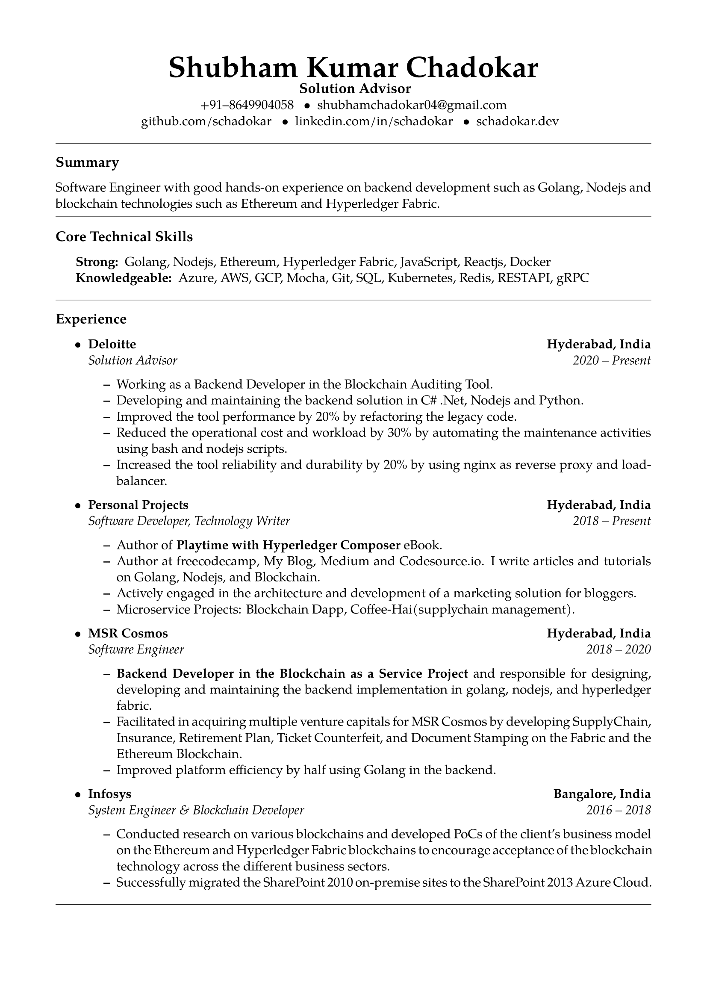

# Classic Resume

Made in LaTex using [Overleaf](https://overleaf.com).

This is a modified template of [toofishes.net](https://www.toofishes.net/blog/latex-resume-follow-up/) and [Rudra Narayan Kar](https://github.com/mrprofessor/resume) templates.

###### ScreenShot

<kbd>
     
     
</kbd>
